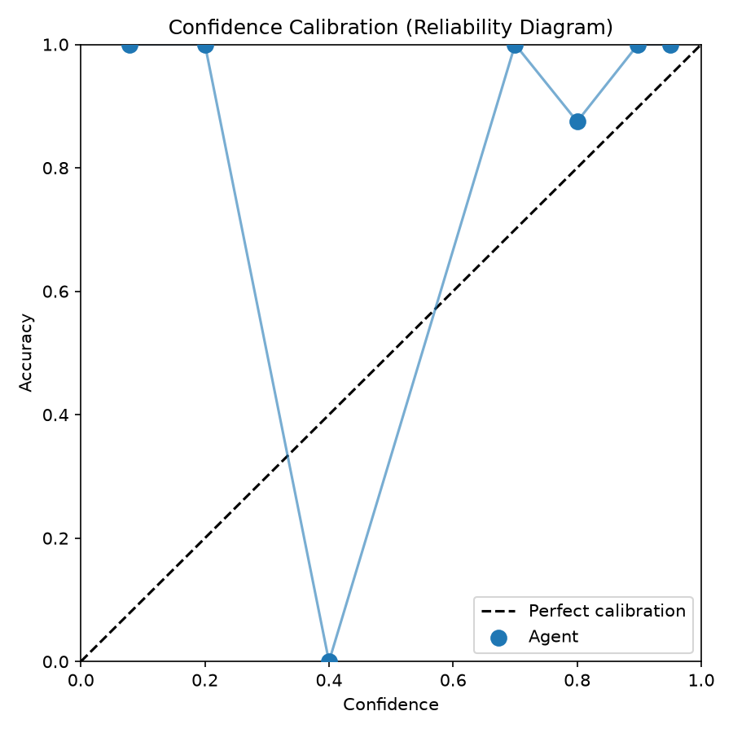

# Asendia Voice Agent Eval

Eval harness for AI candidate screening agents: built as a Product Engineer application project for [Asendia AI](https://asendia.ai).

**Primary metric: confidence calibration (ECE), not accuracy alone.**

## Results (hand-curated golden set — no API key needed)

| Metric | Value |
|--------|-------|
| Golden set | 100 staffing phone screens ([spec](docs/DATASET.md)) |
| Accuracy | **95.0%** |
| **ECE (Expected calibration Error)** | **0.48** |
| High-confidence error rate (≥80, wrong) | **1.1%** (1 case) |
| Model | Groq `llama-3.3-70b-versatile` · seed 42 |

When the agent says “80% confident”, that should mean: about 80% of those calls were actually correct.

Low ECE (good): Confidence matches reality. You can trust thresholds like “auto-submit if ≥ 80.”
High ECE (bad): Confidence is misleading — the agent might be right often but wrong about how sure it is.



Full write-up: [docs/REPORT.md](docs/REPORT.md) · Raw: [results/summary.json](results/summary.json) · [failure_cases.md](results/failure_cases.md)

> 95% accuracy with poor calibration means confidence scores aren't yet trustworthy for auto-submit thresholds — exactly why this harness exists before production.

## Problem

Staffing agencies need to know not just *"does the agent decide?"* but *"can we trust that decision — and does the agent know when it's uncertain?"*

This repo benchmarks an LLM screening agent against **held-out recruiter submit decisions**, with **confidence calibration** as the primary metric.

## What it does

1. Loads a **100-record staffing screen eval set** — curated for Sarah-style phone screens
2. **Holds out** `decision` and `reason` during scoring
3. Replays interview **transcripts turn-by-turn** (no label leakage)
4. Runs a scoring agent → `select/reject`, confidence (0–100), reasoning
5. Computes accuracy, precision, recall, **ECE**
6. Surfaces high-confidence failures — confident but wrong

Architecture: [docs/ARCHITECTURE.md](docs/ARCHITECTURE.md)

## Quick start

```bash
git clone https://github.com/aravindmohan/asendia-voice-agent-eval.git
cd asendia-voice-agent-eval
python -m venv .venv && source .venv/bin/activate
pip install -r requirements.txt

# Review results (no API key)
open results/calibration.png
cat docs/REPORT.md

# Validate dataset
python scripts/validate_dataset.py

# Re-run eval (optional)
cp .env.example .env   # add GROQ_API_KEY or OPENAI_API_KEY
python scripts/run_eval.py --no-followups --concurrency 10 --seed 42
```

## Input / Output

**Input:** `transcript`, `resume`, `job_description`

**Output:**
```json
{
  "predicted_decision": "select",
  "confidence": 78,
  "reasoning": "...",
  "risk_flags": [],
  "escalate_to_human": false,
  "turns_processed": 12
}
```

## Project structure

```
├── data/eval/records.jsonl    # 100-record golden set (committed)
├── src/data/corpus/             # Curated record definitions
├── src/agents/                  # Orchestrator, interviewer, scorer
├── src/llm/client.py            # Async LLM client (Groq/OpenAI/Gemini)
├── results/                     # Eval outputs on hand-curated golden set (committed)
├── docs/REPORT.md               # Findings + Asendia deployment plan
└── scripts/run_eval.py
```
